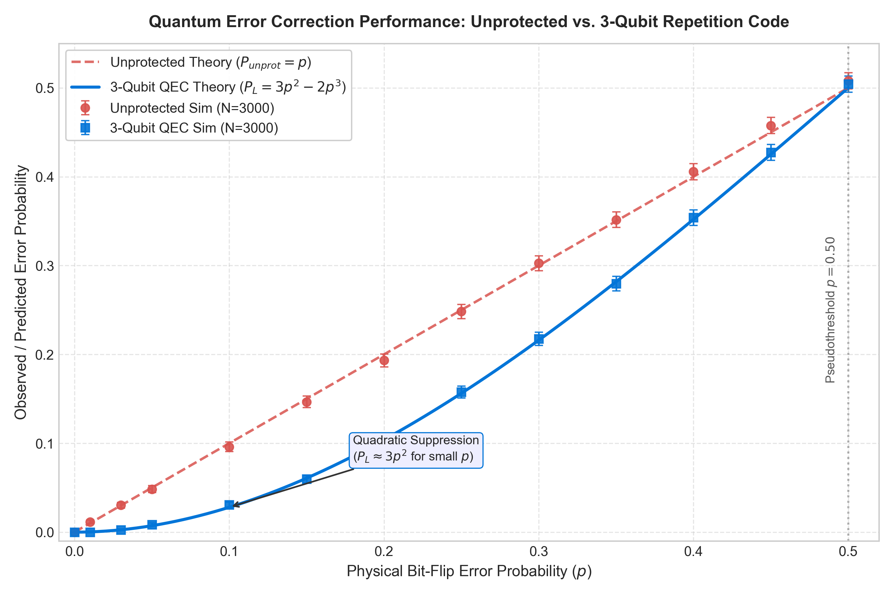

# QubitLab
### An Interactive Quantum Noise & Error Correction Playground

I understood the basic ideas behind quantum computing—qubits, superposition, entanglement, and measurement—from coursework and textbooks, but I wanted to move beyond static equations and actually experiment with quantum systems in code. 

**QubitLab** is an interactive quantum computing playground built with Python, Qiskit, and Streamlit. It investigates a fundamental question in quantum information science:

> **What actually happens to quantum information when physical noise is introduced, and how much can simple quantum error correction help?**

Instead of merely displaying static figures or theoretical curves, QubitLab executes real quantum circuits on Qiskit Aer, allowing you to prepare quantum states, inject physical noise channels, extract error syndromes using ancilla qubits, apply conditional corrections, and observe how logical error rates scale compared to theoretical predictions.

---

## What You Can Explore

1. **🔬 State Playground:** Prepare canonical states ($|0\rangle, |1\rangle, |+\rangle, |-\rangle, |i\rangle$) or customize arbitrary single-qubit states using Bloch sphere polar ($\theta$) and azimuthal ($\phi$) angles. Inspect the resulting 3D Bloch sphere, computational basis measurement statistics, and the Qiskit circuit.
2. **⚡ Noise Explorer:** Subject quantum states to **Bit-Flip (Pauli X)**, **Phase-Flip (Pauli Z)**, and **Depolarizing** noise channels. Observe state decoherence visually as the Bloch vector contracts inside the unit sphere, transitioning from a pure state to a mixed state with quantifiable purity $\text{Tr}(\rho^2)$.
3. **🛠️ Interactive QEC Walkthrough:** Deterministically inject specific Pauli errors (No Error, Flip Qubit 0, Flip Qubit 1, Flip Qubit 2, Flip Two Qubits, or Phase-Flip Qubit 0). Trace the complete lifecycle step-by-step:
   $$\text{Encoding} \longrightarrow \text{Channel Noise} \longrightarrow \text{Ancilla Parity Checks} \longrightarrow \text{Syndrome Diagnosis} \longrightarrow \text{Correction} \longrightarrow \text{Decoded Readout}$$
4. **⚖️ QEC ON vs. OFF:** Compare an unprotected single-qubit transmission directly against the 3-qubit repetition code at the identical physical noise probability $p$. Measure the empirical error reduction factor.
5. **📈 Theory vs. Simulation Benchmark:** Run live Monte Carlo sweeps across physical noise probabilities $p \in [0.00, 0.50]$ with customizable shot counts. Directly compare simulated frequencies with analytical predictions ($P_L = 3p^2 - 2p^3$).
6. **🎲 Single-Trial Inspector:** Step through a single stochastic trial in "slow motion," observing how random Bernoulli bit flips strike physical qubits and how ancilla parity measurements pinpoint which qubit to flip.
7. **🎯 Predict & Verify:** Test your quantum intuition on specific error scenarios (such as two simultaneous bit flips or a phase-flip error) and verify what the quantum circuit actually does.
8. **📚 Knowledge Base:** In-app explanations of key concepts including non-demolition syndrome extraction, the No-Cloning Theorem, majority voting failure, and real-world fault tolerance.

---

## Quantum Error Correction: The 3-Qubit Repetition Code

In classical computing, error correction is achieved by copying bits: $0 \to 000$ and $1 \to 111$. In quantum mechanics, the **No-Cloning Theorem** forbids copying unknown quantum states ($|\psi\rangle \not\to |\psi\rangle \otimes |\psi\rangle$). Furthermore, measuring physical qubits directly collapses superpositions.

The 3-qubit bit-flip code solves both challenges through **entanglement** and **parity measurements**:

### 1. Encoding
A single logical state $|\psi\rangle = \alpha|0\rangle + \beta|1\rangle$ is encoded across three physical qubits using entangling CNOT gates:
$$|\psi_L\rangle = \alpha|000\rangle + \beta|111\rangle$$
No cloning takes place; the state exists as an entangled multi-qubit superposition.

### 2. Non-Demolition Syndrome Extraction
To detect errors without collapsing $\alpha$ and $\beta$, the circuit entangles the data qubits with **two ancilla qubits** to measure two parity operators:
* Ancilla 0 measures: $s_0 = q_0 \oplus q_1$ (checks if $q_0$ and $q_1$ agree)
* Ancilla 1 measures: $s_1 = q_1 \oplus q_2$ (checks if $q_1$ and $q_2$ agree)

Because both basis codewords $|000\rangle$ and $|111\rangle$ have even parity ($s_0=0, s_1=0$), measuring the ancillas extracts error information while leaving the logical superposition completely undisturbed.

### 3. Syndrome Table & Feed-Forward Correction
| Extracted Syndrome $(s_0, s_1)$ | Parity Diagnosis | Corrective Action Applied |
| :---: | :--- | :--- |
| **(0, 0)** | All three qubits agree | Do nothing (Identity) |
| **(1, 0)** | $q_0 \neq q_1$, but $q_1 = q_2 \implies q_0$ is the outlier | Apply Pauli $X$ to Qubit 0 |
| **(1, 1)** | $q_1$ disagrees with both $q_0$ and $q_2 \implies q_1$ is the outlier | Apply Pauli $X$ to Qubit 1 |
| **(0, 1)** | $q_0 = q_1$, but $q_1 \neq q_2 \implies q_2$ is the outlier | Apply Pauli $X$ to Qubit 2 |

In modern Qiskit, this is implemented natively as a dynamic circuit with feed-forward conditional blocks:
```python
with qc.if_test((cr_syn, 1)):  # syn = '01' (q0 flipped)
    qc.x(qr_data[0])
```

---

## Theory vs. Simulation

For independent physical bit-flip errors occurring with probability $p$ on each physical qubit:
* **Unprotected System:** Fails whenever a single error occurs:
  $$P_{\text{unprot}} = p$$
* **3-Qubit Repetition Code:** Successfully corrects 0 or 1 error, and fails if and only if 2 or 3 qubits flip independently:
  $$P_L = \binom{3}{2} p^2 (1-p) + \binom{3}{3} p^3 = 3p^2(1-p) + p^3 = \mathbf{3p^2 - 2p^3}$$

### Key Mathematical Insights
1. **Quadratic Suppression:** For small $p$ ($p \ll 1$), $P_L \approx 3p^2$. Because logical error scales quadratically while physical error scales linearly, small reductions in physical noise yield dramatic improvements in logical fidelity:
   * At $p = 5\%$: $P_{\text{unprot}} = 5.0\%$, while $P_L \approx \mathbf{0.73\%}$ (a **$6.8\times$ error reduction**).
   * At $p = 1\%$: $P_{\text{unprot}} = 1.0\%$, while $P_L \approx \mathbf{0.03\%}$ (a **$33\times$ error reduction**).
2. **The Pseudothreshold:** Setting $P_L = P_{\text{unprot}}$ yields $3p^2 - 2p^3 = p \implies \mathbf{p = 0.50}$.
   * When $p < 0.50$, quantum error correction outperforms the unprotected system.
   * When $p > 0.50$, adding extra qubits actually worsens fidelity because majority voting is overwhelmed.

### Benchmark Results
Below is the empirical benchmark generated by `main.py` over 3,000 Monte Carlo shots per point on `qiskit_aer.AerSimulator`:

| Physical $p$ | Unprotected (Sim) | Unprotected (Theory) | 3-Qubit QEC (Sim) | 3-Qubit QEC (Theory) | Error Reduction |
| :---: | :---: | :---: | :---: | :---: | :---: |
| **0.000** | 0.0000 | 0.0000 | 0.0000 | 0.0000 | 1.00x |
| **0.010** | 0.0117 | 0.0100 | 0.0000 | 0.0003 | >100x |
| **0.030** | 0.0303 | 0.0300 | 0.0027 | 0.0026 | 11.38x |
| **0.050** | 0.0483 | 0.0500 | 0.0087 | 0.0073 | 5.58x |
| **0.100** | 0.0960 | 0.1000 | 0.0307 | 0.0280 | 3.13x |
| **0.150** | 0.1467 | 0.1500 | 0.0597 | 0.0608 | 2.46x |
| **0.200** | 0.1933 | 0.2000 | 0.1000 | 0.1040 | 1.93x |
| **0.300** | 0.3027 | 0.3000 | 0.2177 | 0.2160 | 1.39x |
| **0.500** | 0.5080 | 0.5000 | 0.5043 | 0.5000 | 1.01x |



---

## Code Limitations & Scientific Realities

QubitLab is designed to be technically honest and transparent about what simple repetition codes can and cannot do:

1. **The Phase-Flip ($Z$) Blind Spot:** The 3-qubit bit-flip code only measures bit parities ($Z_0 Z_1$ and $Z_1 Z_2$). It is completely blind to relative phase errors ($Z$). A Pauli $Z$ error on $|+_L\rangle$ causes a 100% logical phase flip while producing a null syndrome `(0, 0)`. Real quantum computers require 2D codes (such as Shor's 9-qubit code, Steane's 7-qubit CSS code, or surface codes) that measure both $X$ and $Z$ stabilizers simultaneously.
2. **Two-Error Failure:** If two physical qubits flip (e.g., $q_0$ and $q_1$), the syndrome indicates that $q_2$ is the outlier. The correction flips $q_2$, leaving all three qubits flipped and causing an uncorrectable logical NOT error.
3. **Phenomenological vs. Circuit-Level Noise:** In this playground, noise is introduced primarily during channel transmission. In physical quantum hardware, the CNOT gates and ancilla measurements themselves are noisy, meaning syndrome extraction can introduce and spread errors. Fault tolerance requires topological surface codes with thousands of physical qubits per logical qubit.

---

## Project Architecture

```
qubitlab/
├── README.md                 # Public documentation and project overview
├── requirements.txt          # Pinned project dependencies
├── app.py                    # Streamlit interactive web application
├── main.py                   # Command-line benchmark runner & demo
├── .gitignore                # Git ignore rules
│
├── src/                      # Quantum simulation engine
│   ├── __init__.py
│   ├── states.py             # State representations, Bloch vectors, density matrices
│   ├── circuits.py           # Qiskit circuit builders & dynamic QEC pipelines
│   ├── noise.py              # Qiskit Aer NoiseModels & analytical channel maps
│   ├── error_correction.py   # 3-qubit QEC logic, syndrome tables, step walkthroughs
│   ├── simulation.py         # Monte Carlo shot simulations, sweeps, trial traces
│   └── analysis.py           # Theoretical equations, standard errors, statistical tests
│
├── components/               # UI presentation layer
│   ├── __init__.py
│   ├── visualizations.py     # Interactive Plotly 3D Bloch sphere & charts
│   └── explanations.py       # Contextual educational expanders
│
├── tests/                    # Automated pytest test suite
│   ├── __init__.py
│   ├── test_circuits.py      # Circuit construction & state preparation tests
│   ├── test_error_correction.py # Deterministic error injection & failure tests
│   └── test_simulation.py    # Monte Carlo simulation & statistical agreement tests
│
└── results/                  # Generated benchmark data & publication figures
    ├── error_rates.png       # Matplotlib comparison graph
    └── experiment_results.csv # Empirical sweep data
```

---

## Tech Stack

* **Language:** Python 3.10+
* **Quantum SDK:** Qiskit 1.2+, Qiskit Aer 0.17+
* **Numerical & Data:** NumPy, SciPy, Pandas
* **Visualization:** Plotly (interactive 3D Bloch sphere & charts), Matplotlib / Pylatexenc (circuit diagrams)
* **Web Interface:** Streamlit
* **Testing:** Pytest

---

## Running Locally

### 1. Clone the repository
```bash
git clone https://github.com/puzzlelvr12/Qiskit-lab.git
cd Qiskit-lab
```

### 2. Create and activate a virtual environment
```bash
# macOS/Linux
python3 -m venv .venv
source .venv/bin/activate

# Windows (PowerShell)
python -m venv .venv
.venv\Scripts\Activate.ps1
```

### 3. Install dependencies
```bash
pip install -r requirements.txt
```

### 4. Run the interactive Streamlit application
```bash
streamlit run app.py
```
Open [http://localhost:8501](http://localhost:8501) in your browser.

### 5. Run the command-line benchmark
```bash
# Run terminal demo and benchmark sweep (saves results/error_rates.png)
python main.py

# Run only the CLI walkthrough demo
python main.py --demo

# Run with custom shot count
python main.py --shots 5000
```

---

## Running Automated Tests

Run the complete 23-test automated test suite using pytest:
```bash
pytest -v
```
All tests verify state preparation, single error diagnosis on all qubits, two-error failure modes, phase-flip undetected limitations, dynamic circuit execution on AerSimulator, and statistical convergence to theoretical predictions.
